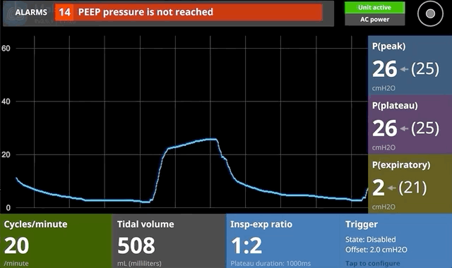

# MakAir Control UI

  

## Versions

| Version | Last Changelog | Ready? |
| ------- | -------------- | ------ |
| V1.1.x | Operational initial release | ✅
| V1.2.x | Crashes fixed + smoother graph + implemented medical staff feedbacks | ✅
| V1.3.x | Improve text readability, by increasing font sizes | ✅
| V1.4.x | Added internationalization capabilities | ✅
| V1.5.x | Improve UI readability + allow to change MakAir's settings | ✅
| V2.0.x | Telemetry protocol version update to V2 + large code rework + improved UI/UX + reduced CPU usage + translated alarms + regulatory compliance | ❌

## How To Build?

### Building on a computer (for development)

In order to setup your environment and build the code, please follow these steps:

1. Install [Rustup](https://rustup.rs/)
2. Ensure you are using the Rust stable toolchain: `rustup default stable`
3. On Linux, make sure you have `cmake` installed and those libraries (debian):
  `libxcb-shape0 libxcb-shape0-dev libxcb-xfixes0 libxcb-xfixes0-dev libfontconfig libfontconfig1-dev libudev-dev`
4. Build the project: `cargo build`

Wayland support may be available but it hasn't been tested. You need a working X11 server.

_Tested with Rust version: `rustc 1.47.0 (18bf6b4f0 2020-10-07)`_

### Building on a MakAir ventilator (for end use)

Building directly on a ventilator is convenient for testing purposes while developing. The Raspberry Pi boards in ventilators run ArchLinux. To build on a ventilator:

1. Make sure `glibc` is up to date (e.g. by running `pacman -S glibc` as root)
2. Install the following packages:
  `git gcc make cmake pkg-config`
3. Enable NTP by running `timedatectl set-ntp TRUE`
4. Install [Rustup](https://rustup.rs/)
5. Ensure you are using the Rust stable toolchain: `rustup default stable`
6. Clone the repository and build the project: `cargo build --release`

**Warning:** Do NOT perform a full system upgrade. This has been observed to break the software.

## How To Run?

### Quick start

To run the Control UI, please ensure that your device first has an open serial connection with the motherboard.

_Note that the Control UI relies on the MakAir Telemetry library, which gets pulled from the [makair-telemetry](https://github.com/makers-for-life/makair-telemetry) repository._

Take note of the serial port used as an input on your Control UI board, and call:

1. Run: `./makair-control --port=0` (where `--port` is your serial port ID, maybe /dev/ttyUSB0)

You may also play a pre-recorded file, by passing it as an input (this is handy while developing; example records are available in the telemetry library repository):

1. Pull the telemetry library (in the parent directory): `git pull https://github.com/makers-for-life/makair-telemetry.git`
2. Run an example (from the Control UI directory): `./makair-control --input=../makair-telemetry/records/short_with_errors` (where `--input` is an UNIX file path)

### Available options

The following options can be passed to the Control UI upon running it:

* `--log={level}`: log level, where `{level}` is one of: `debug`, `info`, `warn`, `error`;
* `--port={id}`: serial port identifier to connect to the firmware via the telemetry protocol, where `{id}` is a serial port ID, eg. `1`;
* `--input={file}`: path to a telemetry record to play in the UI, where `{file}` is a record file (all UI controls will be inactive);
* `--output={directory}`: path to directory in which telemetry records should be stored, where `{directory}` is a path (disabled by default);
* `--fullscreen`: enables fullscreen mode (used on the final ventilator display only);
* `--translation={locale}`: locale to use in the UI, where `{locale}` is a [supported locale code](#supported-translations);
* `--disable-lora`: disables LoRa telemetry broadcasts (`lora` build feature);
* `--lora-device={device}`: lora device path, where `{device}` is a path eg. `/dev/ttyAMA0` (`lora` build feature);

## Supported Translations

As MakAir was designed to be used internationally, we have made sure that the Control UI was fully translated in major languages.

You can pass the desired locale code when running the `makair-control` binary, using the `--translation` argument. _Make sure to pass the locale ISO code, eg. for French: `--translation=fr`._

**➡️ You can find the list of supported languages, with their ISO language codes below:**

* 🇬🇧 **[English](./res/locales/en.ftl)**: `en`
* 🇫🇷 **[French](./res/locales/fr.ftl)**: `fr`
* 🇩🇪 **[German](./res/locales/de.ftl)**: `de`
* 🇮🇹 **[Italian](./res/locales/it.ftl)**: `it`
* 🇪🇸 **[Spanish](./res/locales/es.ftl)**: `es`
* 🇵🇹 **[Portuguese](./res/locales/pt.ftl)**: `pt`
* 🇱🇻 **[Latvian](./res/locales/lv.ftl)**: `lv`
* 🇷🇺 **[Russian](./res/locales/ru.ftl)**: `ru`
* 🇺🇦 **[Ukrainian](./res/locales/uk.ftl)**: `uk`
* 🇨🇳 **[Chinese (Simplified)](./res/locales/zh.ftl)**: `zh`

ℹ️ If your language does not appear in the list above, you may translate the [base English file](./res/locales/en.ftl), then [open a Pull Request](https://github.com/makers-for-life/makair-control-ui/pulls).

## How To Build A Release? (Cross-Compile For ARM)

To cross-compile a new release for an ARM target (using MUSL; statically-linked libraries), you can call the `release_binaries.sh` script:

1. Run: `./scripts/release_binaries.sh --version=1.0.0`

_Make sure to replace the `version` script argument with the current release version. This is used for file naming purposes only._

**⚠️ Important note: this is still a work in progress. We are near cross-compiling capabilities, though some work still needs to be done due to non-MUSL C-based dependencies. See issue [#38](https://github.com/makers-for-life/makair-control-ui/issues/38).**

## Optional Features

The Control UI behavior can be tuned at compile time, by enabling some optional features while building the binary:

* **Automatic graph scaler:**
  * Feature name: `graph-scaler`
  * Build command: `cargo build --features=graph-scaler`
  * Purpose: enables automatic graph maximum calculation, and re-adjustments as the target peak pressure is adjusted by an operator, or the largest point pressure value on screen overflows the graph. This overrides the default static maximum pressure value, that is based on the theoretical saturation maximum in an human subject. While the dynamic graph scaler system was previously the default, based on medical staff feedback it has been made static in order to improve machine usability in real-world scenarios. The auto-scaler feature was confusing for them, as traditional respirator systems use an hardcoded maximum.

* **Radio broadcasting of metrics over [LoRa / LoRaWAN](https://en.wikipedia.org/wiki/LoRa):**
  * Feature name: `lora`
  * Build command: `cargo build --features=lora`
  * Purpose: enables periodic radio broadcasts of metrics, using an attached LoRa transmitter chip. This is an experimental feature, that is turned off by default. It aims at helping us build a central monitoring dashboard for hospitals, nesting all running MakAir metrics together.

## Troubleshooting

In case of an issue, please review the following points and check if any could help:

* If you are on Linux, you need to be a member of the `dialout` group for your user to be able to use the device created by the serial port.
