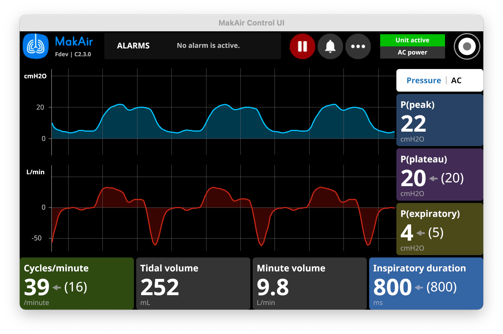

# MakAir Control UI

 

  

## Versions

| Version | Last Changelog | Ready? | Release |
| ------- | -------------- | ------ | ------- |
| V1.1.x | Operational initial release | ✅ | none
| V1.2.x | Crashes fixed + smoother graph + implemented medical staff feedbacks | ✅ | none
| V1.3.x | Improve text readability, by increasing font sizes | ✅ | [view](https://github.com/makers-for-life/makair-control-ui/releases/tag/v1.3.0)
| V1.4.x | Added internationalization capabilities | ✅ | [view](https://github.com/makers-for-life/makair-control-ui/releases/tag/v1.4.0)
| V1.5.x | Improve UI readability + allow to change MakAir's settings | ✅ | [view](https://github.com/makers-for-life/makair-control-ui/releases/tag/v1.5.0)
| V2.0.x | Telemetry protocol version update to V2 + large code rework + improved UI/UX + reduced CPU usage + translated alarms + regulatory compliance | ✅ | [view](https://github.com/makers-for-life/makair-control-ui/releases/tag/v2.0.0)
| V2.1.x | Ventilation modes + flow sensing + new options + new plot renderer | ✅ | [view](https://github.com/makers-for-life/makair-control-ui/releases/tag/v2.1.0)
| V2.2.x | Patient configuration modal + new error messages + UX improvements | ✅ | [view](https://github.com/makers-for-life/makair-control-ui/releases/tag/v2.2.0)
| V2.3.x | Factory calibration utility + show more errors from the firmware | ✅ | [view](https://github.com/makers-for-life/makair-control-ui/releases/tag/v2.3.0)
| V2.4.x | Store user configurations in firmware EEPROM, eg. locale | ❌ | none

## How To Build?

### Building on a computer (for development)

In order to setup your environment and build the code, please follow these steps:

1. Install [Rustup](https://rustup.rs/)
2. Ensure you are using the Rust stable toolchain: `rustup default stable`
3. On Linux, make sure you have `cmake` installed and those libraries (debian):
  `libxcb-shape0 libxcb-shape0-dev libxcb-xfixes0 libxcb-xfixes0-dev libfontconfig libfontconfig1-dev libudev-dev`
4. Build the project: `cargo build`

Wayland support may be available but it hasn't been tested. You need a working X11 server.

As well, please make sure that you have at least 2GB of RAM for the build to complete. Running the UI requires less than 40MB of RAM afterwards (in `release` mode).

_Tested with Rust version: `rustc 1.52.1 (9bc8c42bb 2021-05-09)`_

**Note:** as the MakAir Control UI currently targets a single 7" touch display, the UI only supports a static resolution of 800 x 480 pixels.

### Building on a MakAir ventilator (for end use)

Building directly on a ventilator is convenient for testing purposes while developing. The Raspberry Pi boards in ventilators run ArchLinux. To build on a ventilator:

1. Make sure `glibc` is up to date (e.g. by running `pacman -S glibc` as root)
2. Install the following packages:
  `git gcc make cmake pkg-config`
3. Enable NTP by running `timedatectl set-ntp TRUE`
4. Install [Rustup](https://rustup.rs/)
5. Ensure you are using the Rust stable toolchain: `rustup default stable`
6. Clone the repository and build the project: `cargo build --release`

**Warning:** Do NOT perform a full system upgrade. This has been observed to break the software.

## How To Run?

### Quick start

To run the Control UI, please ensure that your device first has an open serial connection with the motherboard.

_Note that the Control UI relies on the MakAir Telemetry library, which gets pulled from the [makair-telemetry](https://github.com/makers-for-life/makair-telemetry) repository._

Take note of the serial port used as an input on your Control UI board, and call:

1. Run: `./makair-control --port=0` (where `--port` is your serial port ID, maybe /dev/ttyUSB0)

You may also play a pre-recorded file, by passing it as an input (this is handy while developing; example records are available in the telemetry library repository):

1. Pull the telemetry library (in the parent directory): `git pull https://github.com/makers-for-life/makair-telemetry.git`
2. Run an example (from the Control UI directory): `./makair-control --input=../makair-telemetry/records/v2/short.record` (where `--input` is an UNIX file path)

### Available options

The following options can be passed to the Control UI upon running it:

* `--log={level}`: log level, where `{level}` is one of: `debug`, `info`, `warn`, `error` (defaults to `warn` in `release` mode, else `debug`);
* `--port={id}`: serial port identifier to connect to the firmware via the telemetry protocol, where `{id}` is a serial port ID, eg. `1`;
* `--input={file}`: path to a telemetry record to play in the UI, where `{file}` is a record file (all UI controls will be inactive);
* `--output={directory}`: path to directory in which telemetry records should be stored, where `{directory}` is a path (disabled by default);
* `--fullscreen`: enables fullscreen mode (used on the final ventilator display only);
* `--translation={locale}`: locale to use in the UI, where `{locale}` is a [supported locale code](#supported-translations) (defaults to `en`; overrides user settings);
* `--disable-lora`: disables LoRa telemetry broadcasts (`lora` build feature);
* `--lora-device={device}`: LoRa device path, where `{device}` is a path eg. `/dev/ttyAMA0` (`lora` build feature; defaults to `/dev/ttyAMA0`);

## Supported Translations

As MakAir was designed to be used internationally, we have made sure that the Control UI was fully translated in major languages.

You can pass the desired locale code when running the `makair-control` binary, using the `--translation` argument. _Make sure to pass the locale ISO code, eg. for French: `--translation=fr`._

By default, you do not need to pass the target locale, as it is read from user settings and can be changed by the end-user through the UI. If the `--translation` argument is used, then user settings are ignored and the passed locale is forcibly used.

**➡️ You can find the list of supported languages, with their ISO language codes below:**

* 🇬🇧 **[English](./res/locales/en.ftl)**: `en`
* 🇫🇷 **[French](./res/locales/fr.ftl)**: `fr`
* 🇩🇪 **[German](./res/locales/de.ftl)**: `de`
* 🇮🇹 **[Italian](./res/locales/it.ftl)**: `it`
* 🇪🇸 **[Spanish](./res/locales/es.ftl)**: `es`
* 🇵🇹 **[Portuguese](./res/locales/pt.ftl)**: `pt`
* 🇱🇻 **[Latvian](./res/locales/lv.ftl)**: `lv`
* 🇷🇺 **[Russian](./res/locales/ru.ftl)**: `ru`
* 🇺🇦 **[Ukrainian](./res/locales/uk.ftl)**: `uk`

**➡️ Some CJK languages require building with the `fonts-cjk` feature in order to render properly:**

* 🇨🇳 **[Chinese (Simplified)](./res/locales/zh.ftl)**: `zh`

ℹ️ If your language does not appear in the list above, you may translate the [base English file](./res/locales/en.ftl), then [open a Pull Request](https://github.com/makers-for-life/makair-control-ui/pulls).

## How To Build A Release? (Cross-Compile For ARM)

To cross-compile a new release for an ARM target (using MUSL; statically-linked libraries), you can call the `release_binaries.sh` script:

1. Run: `./scripts/release_binaries.sh --version=1.0.0`

_Make sure to replace the `version` script argument with the current release version. This is used for file naming purposes only._

**⚠️ Important note: this is still a work in progress. We are near cross-compiling capabilities, though some work still needs to be done due to non-MUSL C-based dependencies. See issue [#38](https://github.com/makers-for-life/makair-control-ui/issues/38).**

## Optional Features

The Control UI behavior can be tuned at compile time, by enabling some optional features while building the binary:

* **Support for CJK languages (eg. Chinese):**
  * Feature name: `fonts-cjk`
  * Build command: `cargo build --features=fonts-cjk`
  * Purpose: enables font support for CJK languages. As the CJK font weights 10MB+, and given that all assets get bundled in the final release binary, this feature is disabled by default as an optimization on binary size. If you need to use CJK languages in your MakAir ventilator, please build the Control UI with this feature enabled. Note that with this feature disabled, you will still be able to run with a CJK font, though all its glyphs will render as squares.

* **Radio broadcasting of metrics over [LoRa / LoRaWAN](https://en.wikipedia.org/wiki/LoRa):**
  * Feature name: `lora`
  * Build command: `cargo build --features=lora`
  * Purpose: enables periodic radio broadcasts of metrics, using an attached LoRa transmitter chip. This is an experimental feature, that is turned off by default. It aims at helping us build a central monitoring dashboard for hospitals, nesting all running MakAir metrics together.

## Prepared System Images

Prepared system images that run on a Raspberry Pi and pack the Control UI are available in the [makair-files](https://github.com/makers-for-life/makair-files) repository (over Git LFS).

You may use a base system image and update it with any newer version of the UI (compiled on the same image, with additional build tools installed). Image update and flash instructions are available within this repository.

## Troubleshooting

In case of an issue, please review the following points and check if any could help:

* If you are on Linux, you need to be a member of the `dialout` group for your user to be able to use the device created by the serial port.
